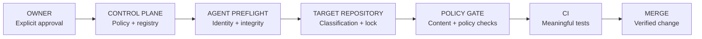

<picture>
  <source media="(prefers-color-scheme: dark)" srcset="assets/control-plane-hero-dark.svg">
  <source media="(prefers-color-scheme: light)" srcset="assets/control-plane-hero-light.svg">
  
</picture>

# HOUSE NET · ENGINEERING CONTROL PLANE

**The engineering authority for HouseNet repositories and coding agents.**

Policy is structured. Repositories are classified. Changes require owner authority. Gates verify what can be verified; documentation names the limits.

[](https://github.com/HouseNet-Projects/house-net-control-plane/actions/workflows/control-plane-ci.yml)

[Policy](docs/POLICY.md) · [Architecture](docs/ARCHITECTURE.md) · [Enforcement](docs/ENFORCEMENT.md) · [Agent bootstrap](docs/AGENT-BOOTSTRAP.md) · [Repository lifecycle](docs/REPOSITORY-LIFECYCLE.md)

---

## Control plane status

| Surface | Current authority |
| :--- | :--- |
| **POLICY VERSION** | **1.0.0** · [machine manifest](policy/manifest.json) |
| **CLASSIFICATION** | **A — CRITICAL** · engineering and agent governance |
| **AUTHORITY** | `HouseNet-Projects` · explicit owner approval |
| **AGENTS** | Codex bootstrap; Claude-ready repository maps |
| **ENFORCEMENT** | Executable validators + CI; [verified capabilities and gaps](docs/ENFORCEMENT.md) |
| **REPOSITORY REGISTRY** | [One approved repository](registry/repositories.json) · no future creation implied |

### The operating circuit



## Start with authority

```bash
/home/gevorg/house-net-control-plane/bin/housenet-preflight --json
```

A mandatory failure returns a nonzero exit code. Stop and report it. The preflight checks current remote `main` without changing the local checkout. An approved repair must precede further work.

Read the current [authority rules](policy/authority.json), [class definitions](policy/repository-classes.json), and the target repository's `house-net-control.json`. Memory is not a policy source.

## Three classes. Proportional control.

| Class | Applies to | Engineering posture |
| :--- | :--- | :--- |
| **A · CRITICAL** | Production, customer data, billing, identity, infrastructure, privileged control systems | Strongest practical protection; stable CI; explicit deployment and recovery design |
| **B · STANDARD** | Maintained applications, services, APIs, integrations and automation | Useful tests; clean PR flow; protection where supported |
| **C · LIGHTWEIGHT** | Documentation, prototypes, low-risk utilities and approved reference material | Clear purpose; clean history; no decorative governance |

**MANDATORY** means owner override only. **RECOMMENDED** means the preferred default. **REPO_SPECIFIC** requires a decision based on purpose, risk and technology.

## Machine authority

| Domain | Canonical file |
| :--- | :--- |
| Ownership, approval and scope | [authority.json](policy/authority.json) |
| Classification and repository foundations | [repository-classes.json](policy/repository-classes.json), [repository-baseline.json](policy/repository-baseline.json) |
| Git and merge behavior | [git.json](policy/git.json), [merge.json](policy/merge.json) |
| Automation and dependency security | [actions.json](policy/actions.json), [security.json](policy/security.json) |
| High-signal notifications | [notifications.json](policy/notifications.json) |
| Version, provenance and coverage | [manifest.json](policy/manifest.json) |

[JSON Schemas](schemas/) constrain the machine files. [POLICY.md](docs/POLICY.md) is generated from those files. The [original owner policy](docs/source/HouseNet-GitHub-Policy-v1.0.md) is immutable provenance, not a second runtime authority.

## Engineering workbench

Python 3.12 is the CI reference runtime. The dedicated WSL runtime is also tested. The validator uses JSON Schema and a strict YAML parser; dependencies are version- and hash-locked.

```bash
python3.12 -m venv .venv
.venv/bin/python -m pip install --require-hashes --no-deps -r requirements.txt
.venv/bin/python bin/validate-control-plane --json
PYTHONDONTWRITEBYTECODE=1 .venv/bin/python -m unittest discover -s tests -v
.venv/bin/python bin/check-syntax
```

For the provisioned WSL, the validator dependencies already exist in the installed Python environment. No global package installation is required.

### Future repository gate

Use the [registration lock](templates/house-net-control.json), [agent maps](templates/AGENTS.md), and [workflow template](templates/house-net-policy-gate.yml) only after a proposal is classified and approved. The reusable gate executes trusted code from this private repository; it does not trust a caller-supplied registry or validator.

A template does **not** authorize creation. A passing CI check does **not** grant approval. Server protection, behavioral guidance and executable checks are distinct layers.

---

## Design and maintenance

Original light/dark SVGs are stored locally. Their neutral network motif is a repository design, not an official HouseNet logo or claim of official brand colors.

Maintained by **HouseNet-Projects**. No production deployment is configured. Changes follow **branch → change → test → PR → verified merge**. See [CHANGELOG](CHANGELOG.md) and [the verification record](audit/VERIFICATION.md).
