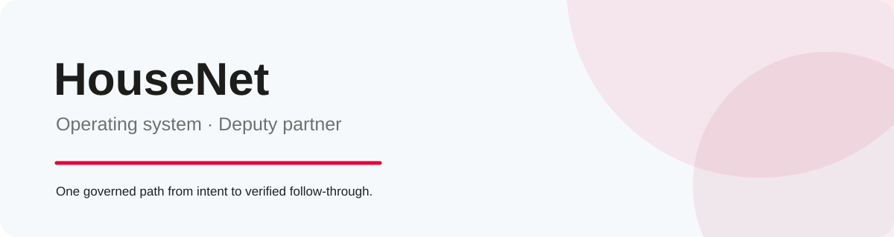
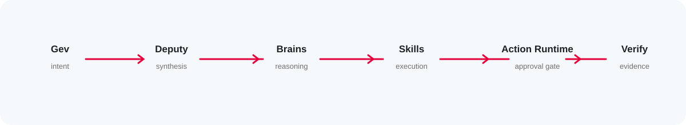
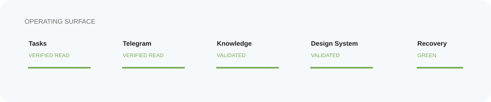
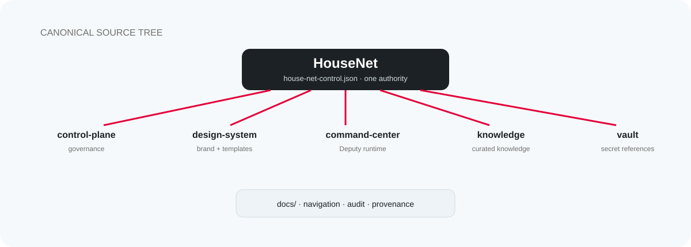

<p align="center">
  <picture>
    <source media="(prefers-color-scheme: dark)" srcset="design-system/assets/github/hero-dark.svg">
    <source media="(prefers-color-scheme: light)" srcset="design-system/assets/github/hero-light.svg">
    
  </picture>
</p>

<p align="center"><strong>HouseNet</strong> is the governed operating system for turning intent into clear work, evidence and follow-through.<br><strong>Deputy</strong> is its single operating partner: one identity, many professional brains, one verified result.</p>

<p align="center">
  <a href="https://github.com/HouseNet-Projects/house-net/actions/workflows/house-net-ci.yml"></a>
  <a href="https://github.com/HouseNet-Projects/house-net/blob/main/docs/governance/PUBLIC_AUDIT.md">Public audit</a>
  · <a href="docs/README.md">Documentation</a>
  · <a href="design-system/README.md">Design System</a>
</p>

## The product

<p align="center"><picture><source media="(prefers-color-scheme: dark)" srcset="design-system/assets/github/product-dark.svg"><source media="(prefers-color-scheme: light)" srcset="design-system/assets/github/product.svg"></picture></p>

HouseNet brings governance, operating work, durable knowledge, brand standards and secret references into one canonical repository. Deputy reads the current state, reasons across professional domains, prepares work and keeps the loop visible. Material external changes stay behind explicit approval and independent verification.

Հայերեն՝ HouseNet-ը կառավարվող օպերացիոն համակարգ է, իսկ Deputy-ն՝ մեկ միասնական օպերացիոն գործընկեր։

## System map

<p align="center"><picture><source media="(prefers-color-scheme: dark)" srcset="design-system/assets/github/deputy-flow-dark.svg"><source media="(prefers-color-scheme: light)" srcset="design-system/assets/github/deputy-flow.svg"></picture></p>

| Component | Owns | Explore |
| --- | --- | --- |
| **Control Plane** | policy, authority and repository governance | [`control-plane/`](control-plane/) |
| **Design System** | brand, templates and document standards | [`design-system/`](design-system/) |
| **Command Center / Deputy** | runtime, integrations and operational state | [`command-center/`](command-center/) |
| **Knowledge** | curated durable business knowledge | [`knowledge/`](knowledge/) |
| **Vault** | secret references and recovery metadata | [`vault/`](vault/) |

## What Deputy does

<p align="center"><picture><source media="(prefers-color-scheme: dark)" srcset="design-system/assets/github/what-deputy-dark.svg"><source media="(prefers-color-scheme: light)" srcset="design-system/assets/github/what-deputy.svg"></picture></p>

- understands natural-language requests and routes them to relevant professional brains;
- uses the canonical Skill System, Store and operational state;
- prepares strategies, roadmaps, tasks, reports and follow-through;
- reconciles inbox and channel evidence as untrusted input;
- sends or changes external records only through the single Action Runtime, with exact owner approval and verification.

Professional brains never become separate agents, authorities, memories or writers.

## Current operating surface

<p align="center"><picture><source media="(prefers-color-scheme: dark)" srcset="design-system/assets/github/capabilities-dark.svg"><source media="(prefers-color-scheme: light)" srcset="design-system/assets/github/capabilities.svg"></picture></p>

| Capability | State |
| --- | --- |
| Tasks register | Verified read |
| Telegram | Verified read; governed writes |
| Knowledge | Reachable and validated |
| Design System | Reachable and validated |
| Strategy and follow-through | Available in Command Center |
| Outlook / Office host certification | External host gate |
| Bitrix read | Not configured |
| MikroBILL | Owner deferred |

Status is presented for navigation; the canonical runtime and policy remain in their component folders.

## Repository map

<p align="center">
  <picture>
    <source media="(prefers-color-scheme: dark)" srcset="design-system/assets/github/repo-map-dark.svg">
    <source media="(prefers-color-scheme: light)" srcset="design-system/assets/github/repo-map-light.svg">
    
  </picture>
</p>

```text
control-plane/   governance and contracts
 design-system/  brand and document standards
command-center/  Deputy runtime and operational state
knowledge/       curated knowledge
vault/           secret references and recovery metadata
docs/            navigation, audit and provenance
```

## Validate locally

<p align="center"><picture><source media="(prefers-color-scheme: dark)" srcset="design-system/assets/github/validate-docs-dark.svg"><source media="(prefers-color-scheme: light)" srcset="design-system/assets/github/validate-docs.svg"></picture></p>

```bash
python tools/validate_house_net.py
python control-plane/bin/validate-control-plane --json
python design-system/validators/validate_design_system.py design-system
```

For the full operating contract, start with [`docs/README.md`](docs/README.md), then [`docs/governance/PUBLIC_AUDIT.md`](docs/governance/PUBLIC_AUDIT.md). For contribution and enforcement details, read [`AGENTS.md`](AGENTS.md) and the component guidance nearest to the files you change.

## Canonical identity

<p align="center"><picture><source media="(prefers-color-scheme: dark)" srcset="design-system/assets/github/canonical-dark.svg"><source media="(prefers-color-scheme: light)" srcset="design-system/assets/github/canonical-light.svg"></picture></p>

`HouseNet-Projects/house-net` is the canonical HouseNet source tree. The root control contract is [`house-net-control.json`](house-net-control.json). Runtime truth, policy and approvals are machine-enforced by the component owners and required CI checks.

---

<p align="center"><sub>HouseNet · governed operations with evidence at the end of every loop</sub></p>
