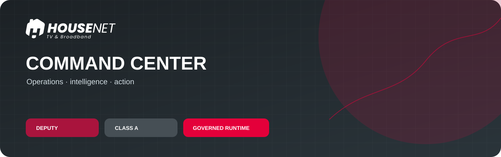
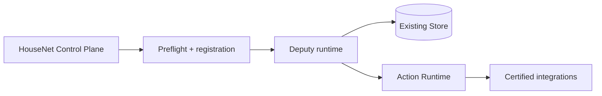

<strong>HOUSE NET · COMMAND CENTER</strong> Deputy’s governed operations, intelligence and action workspace.

 <strong>CLASS A · PUBLIC</strong> · <a href="https://github.com/HouseNet-Projects/house-net-control-plane">CONTROL PLANE</a>

## English

This is the canonical HouseNet home for **Command-center** and its **Deputy** agent identity. The repository preserves the working runtime and its durable architecture while applying the HouseNet governance boundary around it.

### What this surface owns

| Domain | Boundary |
| :--- | :--- |
| **Deputy runtime** | Existing skills, intelligence and operational behavior |
| **Store** | Existing durable state and recovery model |
| **Action Runtime** | Existing approval-aware execution boundary |
| **Integrations** | Existing certified adapters and provider contracts |
| **Evidence** | Tests, evaluations, recovery notes and migration records |

### Governance flow

Solid connectors show governed control flow. The Store remains the durable source for runtime state; external systems remain authoritative for their own records. Caches and generated views are not competing truth sources.

### Start here

- [`house-net-control.json`](house-net-control.json) — repository registration lock.
- [`AGENTS.md`](AGENTS.md) — provider-neutral HouseNet bootstrap map.
- **Local adapter contract** — provider-neutral execution instructions and Deputy charter.
- [`WORKSPACE/`](WORKSPACE/) — operational workspace and registers.
- **Execution adapter directory** — runtime, policy, skills, integrations and tests.
- [`.secure/README.md`](.secure/README.md) — encrypted recovery design; the recovery key remains outside Git.
- [`assets/brand/README.md`](assets/brand/README.md) — local presentation asset provenance.

### Safety boundary

Secrets, provider credentials, production databases, live provider records and machine-local recovery keys are not added to source history. The approved encrypted recovery artifact remains opaque and unchanged. Provider-specific adapters are runtime integration details; HouseNet governance remains provider-neutral.

## Հայերեն

Սա HouseNet-ի **Command-center**-ի և նրա **Deputy** agent identity-ի կանոնական տունն է։ Պահոցը պահպանում է գործող runtime-ը և durable architecture-ը՝ դրա շուրջ կիրառելով HouseNet-ի governance boundary-ը։

### Ինչն է պատկանում այս մակերեսին

| Տիրույթ | Սահման |
| :--- | :--- |
| **Deputy runtime** | Գործող skills, intelligence և operational behavior |
| **Store** | Գործող durable state և recovery model |
| **Action Runtime** | Գործող approval-aware execution boundary |
| **Integrations** | Գործող certified adapters և provider contracts |
| **Evidence** | Tests, evaluations, recovery notes և migration records |

### Կառավարման հոսք

Հոծ կապերը ցույց են տալիս governed control flow-ը։ Store-ը մնում է runtime state-ի durable source-ը, իսկ արտաքին համակարգերը՝ իրենց record-ների authoritative աղբյուրը։ Cache-երը և generated view-երը առանձին truth source չեն։

### Որտեղից սկսել

- [`house-net-control.json`](house-net-control.json) — repository registration lock-ը։
- [`AGENTS.md`](AGENTS.md) — HouseNet-ի provider-neutral bootstrap քարտեզը։
- **Տեղական adapter contract** — provider-neutral execution instructions և Deputy charter։
- [`WORKSPACE/`](WORKSPACE/) — operational workspace-ը և register-ները։
- **Execution adapter directory** — runtime, policy, skills, integrations և tests։
- [`.secure/README.md`](.secure/README.md) — encrypted recovery-ի նկարագրությունը․ recovery key-ը Git-ից դուրս է։
- [`assets/brand/README.md`](assets/brand/README.md) — local presentation asset-ի provenance-ը։

### Անվտանգության սահման

Գաղտնիքները, provider credentials-ը, production database-ները, live provider record-ները և machine-local recovery key-երը source history չեն մտնում։ Հաստատված encrypted recovery artifact-ը մնում է opaque և անփոփոխ։ Provider-specific adapter-ները runtime integration-ի մանրամասներ են, իսկ HouseNet governance-ը մնում է provider-neutral։

## Production operator surface / Արտադրական օպերատորի մակերես

`product_api.py` is the thin operator controller over the canonical Deputy runtime.
It serves the cockpit, attention and approval views, mission questions, source
health, notifications and dry-run previews. It binds to localhost by default;
set `DEPUTY_OPERATOR_TOKEN` before hosting it beyond the local machine.

`product_api.py`-ը բարակ օպերատորի վերահսկիչ է, որը աշխատում է Deputy-ի
կանոնական runtime-ի վրա։ Այն տրամադրում է cockpit, ուշադրության և հաստատումների
տեսքերը, առաքելությունների հարցերը, աղբյուրների առողջությունը, ծանուցումները և
նախնական փորձարկումները։ Լռելյայն կապվում է localhost-ին․ արտաքին հոսթինգից
առաջ սահմանեք `DEPUTY_OPERATOR_TOKEN`։
