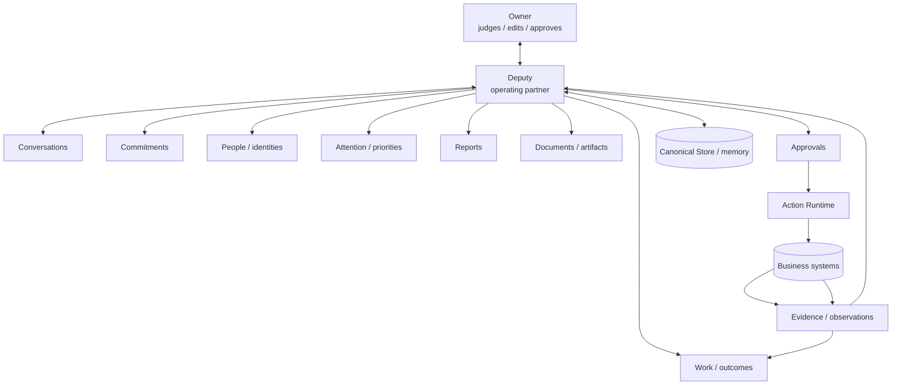

# Deputy Product Bible

**HouseNet Deputy — the governed operating partner for the Owner**
**Product definition, user model, operating model, current truth and completion boundary**
**Evidence date:** 29 September 2026
**Current repository main:** `b4157bae72b84c3af4ba30a9ff59fc3ccc836027`

> **Truth rule.** This document describes the product from the user and business outcome inward. Every current capability is labelled **CONFIRMED / LIVE**, **IMPLEMENTED / NOT LIVE-CERTIFIED**, **DESIGNED / INTENDED**, **PARTIAL**, **BLOCKED / NEEDS SETUP**, or **FUTURE / PROPOSED**. Live claims in this document use the current OCI runtime evidence queried on 29 September 2026. The older `Deputy_Product_Handbook` is an input, not the authority.

> **Հայերեն ամփոփում.** Այս փաստաթուղթը Deputy-ը նկարագրում է որպես արտադրանք՝ օգտվողի և բիզնեսի արդյունքից դեպի ներքին իրականացում։ Յուրաքանչյուր վիճակ նշված է առանձին՝ LIVE, IMPLEMENTED, DESIGNED, PARTIAL, NEEDS SETUP կամ FUTURE։

## 1. Executive product definition

### One line

**Deputy is HouseNet’s persistent operating partner: it watches the Owner’s approved operating world, turns scattered evidence into durable work and decisions, prepares the next useful step, and stops only when Owner judgment or exact approval is required.**

Հայերեն՝ **Deputy-ը HouseNet-ի մշտական օպերացիոն գործընկերն է․ այն դիտարկում է Owner-ի թույլատրված աշխատանքային միջավայրը, տարբեր աղբյուրների տվյալները վերածում է պահպանվող աշխատանքի և որոշումների, պատրաստում է հաջորդ օգտակար քայլը և կանգ է առնում միայն Owner-ի դատողության կամ հստակ հաստատման անհրաժեշտության դեպքում։**

### The 30-second explanation

The Owner does not need to open every source, remember every promise or manually coordinate every follow-up. Deputy reads the registered business sources, keeps the current context in one governed Store, reasons through Claude Max, creates internal Work and commitment candidates, prepares reports/documents/drafts, and shows the Owner what matters. A material external change—sending a message, changing CRM, changing a real meeting or assigning a live task—cannot happen silently: Deputy presents the exact effect, the Owner approves/edits/rejects it, Action Runtime executes it, and Deputy verifies the outcome.

Հայերեն՝ Owner-ը պարտավոր չէ բացել յուրաքանչյուր համակարգ, հիշել յուրաքանչյուր խոստում կամ ձեռքով կազմակերպել բոլոր follow-up-ները։ Deputy-ը կարդում է գրանցված բիզնես աղբյուրները, համատեքստը պահում է մեկ կառավարվող Store-ում, Claude Max-ով վերլուծում է այն, ստեղծում է Work և commitment candidates, պատրաստում է հաշվետվություններ, փաստաթղթեր ու draft-եր, և Owner-ին ցույց է տալիս կարևորները։ Արտաքին նյութական փոփոխությունը կատարվում է միայն հստակ հաստատումից հետո։

### Detailed definition

Deputy is a product layer between a human operator and the business systems that contain the operator’s work. It does not replace those systems. It gives the Owner a durable operating context across them:

- **It observes:** certified Tasks, Outlook Mail, Outlook Calendar, Telegram, Bitrix24 and future registered sources.
- **It understands:** requests, obligations, deadlines, people, relationships, blockers, priorities and uncertainty.
- **It remembers:** conversations, Work, commitments, decisions, people/entity links, source checkpoints, artifacts and completion evidence.
- **It prepares:** internal records, follow-ups, management briefs, documents, drafts and exact external action candidates.
- **It governs:** the boundary between reversible internal preparation and material external authority.
- **It executes:** only the exact approved external action through the canonical Action Runtime.
- **It verifies and follows through:** an API success is not completion; the intended business outcome stays open until evidence exists.

### Mental model

Think of Deputy as a **second operating self with limited external authority**. It can do the reading, sorting, remembering, connecting, drafting and preparation that a capable chief of staff would do. It cannot silently speak or change records as the Owner. The Owner’s scarce time is reserved for judgment, edits, approvals and decisions.

Հայերեն՝ Մտածեք Deputy-ի մասին որպես **երկրորդ օպերացիոն ինքնություն՝ սահմանափակ արտաքին լիազորությամբ**․ այն կարող է կարդալ, համադրել, հիշել, պատրաստել ու վերլուծել, բայց չի կարող լուռ խոսել Owner-ի անունից կամ փոխել արտաքին record-ները։

## 2. The problem Deputy solves

### Before Deputy

The operating world is split across inboxes, chats, calendars, CRM, spreadsheets, documents and memory. The Owner must:

1. check email and Telegram;
2. check calendar and CRM;
3. open the task register;
4. remember what was promised by whom;
5. distinguish what the Owner owes from what others owe the Owner;
6. chase delegated work;
7. reconcile duplicated customer context;
8. prepare a report or file;
9. update multiple systems;
10. remember to check again tomorrow.

This creates five business failures: commitments disappear, important context remains siloed, decisions arrive late, management work is repeated, and no one can tell whether an attempted action actually completed.

### With Deputy

Deputy turns those repeated manual checks into a governed operating loop. It does not promise that every source is connected. It does promise that connected sources share one product model: evidence becomes context; context becomes Work, commitment or attention; preparation becomes a visible decision; approved actions become verified outcomes.

### Why a dashboard is insufficient

A dashboard shows a state at a point in time. A chatbot answers a prompt. A task manager stores assigned work. Deputy must do all three kinds of work while also preserving continuity between them. The defining product question is not “what can I ask?” but **“what useful work continued while I was away, and what now requires my judgment?”**

## 3. Who Deputy is for

### Primary user: the Owner / Owner-operator

The primary user is the person accountable for a multi-system operating environment: revenue, customers, delivery, people, deadlines, decisions and external relationships. In the current HouseNet product language this role is **Owner**, not a personal-name label.

The Owner:

- receives more requests than can be held in working memory;
- delegates work to employees, vendors and partners;
- makes decisions that depend on several systems at once;
- promises work to other people;
- waits for documents, replies, payments or decisions;
- needs management reports but should not build them manually;
- retains final authority over material external changes.

Deputy is not designed first for a casual consumer, a generic personal assistant or a data analyst who only needs a chart. It is designed for a responsible operator who needs continuity, prioritisation and controlled follow-through.

Հայերեն՝ Primary user-ը Owner-operator-ն է՝ այն մարդը, ով պատասխանատու է վաճառքի, հաճախորդների, օպերացիաների, մարդկանց, վերջնաժամկետների և որոշումների համար։

## 4. Product promise and principles

### Product promise

> **Deputy keeps the Owner’s operating work alive across time and systems, prepares what can be prepared without permission, and asks only for the judgment or approval that cannot safely be delegated.**

### Principles

1. **Outcome over module.** The product speaks in priorities, Work, waiting, decisions and results—not provider internals.
2. **Internal autonomy, external authority.** Deputy can think and prepare broadly; external material changes remain governed.
3. **Current truth wins.** Memory provides context. The authoritative current source wins when they conflict.
4. **Evidence before certainty.** Facts, inferences, recommendations and unknowns are separate.
5. **One canonical owner.** There is one Store, one conversation owner, one Work model, one approval model and one Action Runtime.
6. **Partial is better than silent failure.** An unavailable optional source narrows the answer; it does not make the entire product disappear.
7. **Completion is verified.** Attempting an API call is not the same as completing the business outcome.
8. **Quiet by default.** Routine processing stays silent; material attention is surfaced.
9. **Human language first.** Technical evidence exists behind details and Settings.
10. **No invented success.** Unconnected integrations and unsupported data remain visibly unavailable.

## 5. Deputy as an operating partner

An assistant waits for a request. An operating partner maintains a live understanding of what is unfinished, what changed, what is blocked and what must happen next. Deputy’s intended partner behavior is:

- notice a meaningful new request without a chat prompt;
- associate it with an existing person, customer or Work item when evidence supports the link;
- determine whether it is a commitment, a decision, a blocker, an opportunity or FYI;
- prepare the internal work and any safe draft;
- show the Owner the reason and the next step;
- keep watching after an approved action;
- close the loop only when completion evidence exists.

### Current truth versus intended depth

- **CONFIRMED / LIVE:** supervised worker, source ingestion, Work/commitment state, Claude provider, persistent conversations, approval/action runtime, artifact generation and product surfaces exist in the current system.
- **PARTIAL:** the depth of cross-source entity resolution, proactive Claude analysis and outcome-level orchestration varies by source and scenario.
- **DESIGNED / INTENDED:** Deputy should prepare and follow through on every meaningful business matter across all registered channels without the Owner initiating chat.
- **BLOCKED / NEEDS SETUP:** WhatsApp is not configured; MikroBILL is explicitly deferred.

## 6. The complete operating loop

The product loop is not a single API call. It is a continuity loop:

```text
SOURCE OBSERVATION
  → normalize and trust-classify
  → retrieve relevant current context
  → understand people, obligations and outcome
  → correlate with Work, conversations and systems of record
  → update durable memory
  → prioritise and decide whether the event matters
  → prepare internal Work, draft, report or exact action candidate
  → surface to Home / Inbox / Work / Deputy
  → Owner judges, edits, approves or rejects when required
  → Action Runtime executes the exact approved mutation
  → independently verify the result
  → update Work and commitments
  → continue watching until the outcome is complete
```

Հայերեն՝ Աշխատանքի ամբողջական ցիկլը՝ աղբյուրի դիտարկում → նորմալացում → համատեքստ → կապում → հիշողություն → առաջնահերթություն → պատրաստում → ներկայացում → Owner-ի որոշում/հաստատում → Action Runtime → verification → follow-through։

### What happens without a user prompt

The worker operates on a cadence and checkpoint model. It can:

- ingest configured source changes;
- deduplicate repeated observations;
- detect deadlines, requests and commitment candidates;
- update internal Work and commitments;
- evaluate overdue or waiting states;
- prepare a follow-up or management output;
- surface a meaningful item on Home/Inbox.

It should stay silent for low-value FYI, duplicate unchanged records, routine health checks and evidence that does not change an operating decision. A source failure is recorded as partial data and should only block a function that actually depends on that source.

## 7. Core product concepts

These are product concepts, not merely database tables. The canonical owner in parentheses is the implementation authority currently declared in the repository.

| Concept | Product meaning | Lifecycle | User-visible behavior | Canonical owner |
|---|---|---|---|---|
| **Observation** | A source event or fact received from a registered system. | received → normalised → deduped → processed | Usually hidden; appears as evidence or a change. | Integration adapters / Store |
| **Evidence** | A source reference supporting a fact, inference or completion claim. | observed → referenced → retained under policy | “Sources / Evidence / Details”. | Store + source adapters |
| **Conversation** | A durable exchange that carries user intent and local context across turns. | new → active → reopened/archived | Deputy chat history and follow-ups. | `conversation_store.py` |
| **Person / Entity** | A human or company identity with source identifiers and confidence. | candidate → confirmed / conflict / unresolved | Used to explain who owes what and which Work is related. | Store / people capability |
| **Work** | A durable outcome Deputy manages, beyond one conversation. | proposed → active → waiting/blocked → completed | Work page, Home, evidence and next step. | `work_orchestrator.py` |
| **Commitment** | An obligation someone owes or the Owner owes. | candidate → active → due/overdue → fulfilled/unverified | Home, Work and follow-up attention. | `commitments.py` |
| **Decision** | A recorded choice, rationale, alternatives and effective date. | proposed → confirmed → superseded/reviewed | Decision context and audit detail. | `decisions.py` |
| **Attention item** | A prioritised situation that needs awareness or judgment. | detected → surfaced → acknowledged/resolved | Home and Inbox. | Alerts/attention state |
| **Approval** | Owner authority bound to an exact proposed external effect. | required → approved/rejected/expired/changed | Inbox card with effect, risk and action. | `actions.py` |
| **Action** | An exact external mutation candidate and its execution state. | prepared → approved → executing → verified/failed/unknown | Approval and result card. | `actions.py` |
| **Artifact** | A generated report or document attached to Work/conversation/report context. | generated → available → downloaded/regenerated | Documents page and chat artifact card. | `document_exports.py` |
| **Integration/source** | A declared system with capability, freshness and authority rules. | declared → configured → verified → partial/unavailable | Settings and evidence metadata. | `registry.py` / `health.py` |
| **Notification** | A relevance-filtered message that a meaningful change occurred. | generated → surfaced → resolved | Inbox Notifications; not every source event. | Alerts/Store |

### Missing or underdefined concepts

The repository has strong records for Work, commitments, conversations, decisions, actions and artifacts. **Attention** and **Observation** are present as behavior/state but are less visibly unified as first-class product objects. A future product-hardening effort should make their lifecycle and relationships explicit without adding a second Store.

## 8. How Deputy understands the operating world

Deputy does not treat every source equally or every text as an instruction. The context model has four layers:

1. **Current source facts:** Tasks, calendar, CRM and other authoritative records for the fact type.
2. **Operational state:** Work, commitments, decisions, approvals, conversations and artifacts stored by Deputy.
3. **Evidence:** Mail/chat/document observations that may indicate a request or promise but remain untrusted until supported.
4. **Reasoning:** Claude’s inference, recommendation, prioritisation and identification of missing information.

### Source-of-truth precedence

The integration registry defines authority by fact type. Examples:

- current calendar is authoritative for meeting time;
- Tasks.xlsx is authoritative for the Command Center management register;
- Bitrix is authoritative for Bitrix-native CRM tasks and deal stage;
- MikroBILL is intended to be authoritative for billing, but is not currently configured;
- mail, Telegram and WhatsApp are evidence of requests and commitments, not approval authority.

When two sources disagree, Deputy keeps the contradiction and reports it rather than silently merging it.

## 9. Memory and continuity

### What Deputy remembers

- conversation turns and conversation identity;
- Work outcomes, owner, state, blocker, next step and evidence;
- commitments, due dates, confidence, source and fulfilment state;
- people/entity links and the evidence behind them;
- decisions, rationale, alternatives and review dates;
- observations and source relations;
- approval/action history and verification results;
- generated artifacts and their source/as-of context;
- integration cursors/checkpoints and freshness;
- safe working preferences where implemented.

### What remains transient

Sensitive live message previews and short-lived retrieval context are intentionally bounded by integration freshness policy. Hidden chain-of-thought is not a product memory. A generated answer is historical conversation context; it is not current source truth.

### Restart and recovery

The canonical Store is the persistence boundary. Conversations, identities, Work, commitments, actions, audit and artifact metadata are intended to survive service restart and are included in backup/recovery mechanics. Destructive restore certification still depends on the external OCI recovery key; that key must not be invented or committed.

Հայերեն՝ Memory-ը chat history չէ միայն․ այն ներառում է Work, commitments, decisions, people, evidence, source checkpoints, actions և artifacts։ Current source truth-ը միշտ գերակայում է հին հիշողությանը։

## 10. Work and outcomes

Work is where Deputy stops treating a message as a message and starts managing an outcome. A Work item answers:

- What outcome is intended?
- Who owns it?
- What is the current status?
- What is blocked or waiting?
- What is the next step?
- What evidence supports the state?
- Which people, systems, conversations, commitments, actions and artifacts are related?
- What proves completion?

### Work states

- **Active:** work is in progress.
- **Waiting:** another person/system or Owner decision is expected.
- **Blocked:** a known dependency prevents progress.
- **Completed:** completion evidence exists, not merely an attempted call.

The internal Work Graph can represent dependencies, but normal UX should speak in outcomes and next steps.

## 11. Commitments and follow-through

Deputy distinguishes:

- **Owner owes someone:** Owner promised a deliverable or action.
- **Someone owes Owner:** a counterparty promised information, a file, payment or a next step.
- **Owner delegated:** Owner assigned work to another person.
- **Request to Owner:** an incoming request that needs action or a decision.
- **FYI:** information with no justified obligation.
- **Possible commitment:** weak or ambiguous evidence requiring caution.

A commitment should carry owner, recipient/requester, due date if known, source, confidence, evidence, current state and follow-up status. Deputy may prepare a follow-up internally. Sending that follow-up remains approval-gated.

## 12. Attention, priorities and decisions

Home is not a raw event stream. Deputy prioritises based on evidence:

- urgency and due date;
- overdue duration;
- customer or operational impact;
- dependency blocking other Work;
- Owner explicitly waiting or promising;
- approval waiting or expiry risk;
- meeting imminence;
- repeated unresolved follow-up;
- confidence and evidence quality.

Every high-priority item should have a short human reason, such as “promised to the customer today” or “blocks two active Work items”. No importance should be fabricated when data does not support it.

Decisions are durable outcomes, not only chat sentences. A decision can include maker, rationale, alternatives, effective/review dates, source and related Work.

## 13. Proactive/background operation

### What is real today

- a supervised worker exists and runs cycles;
- source adapters and checkpoints exist;
- inbound observations and commitment extraction exist;
- Work and follow-up state can be updated without a chat turn;
- readiness and health are separate from business-source availability;
- current OCI worker status is running, with a latest cycle recorded as `PARTIAL_SUCCESS` because optional/source work can be incomplete.

### What is not yet equally deep everywhere

- autonomous Claude reasoning over every meaningful source event is implemented in the operating architecture but not uniformly live-certified for every integration/scenario;
- cross-source people/entity matching is deliberately conservative and may remain unresolved;
- outcome-level orchestration across several external systems is stronger as a governed design than as a fully live-certified universal workflow.

### Noise control

Deputy should not call expensive reasoning for every low-value message. Deterministic triage, deduplication, confidence, source relevance, cooldowns and bounded loops decide when deeper reasoning is justified.

## 14. Conversations and interaction

Deputy chat is one entrance to the operating context, not the whole product. A conversation has:

- a persistent conversation ID;
- message history stored in the canonical Store;
- active multi-turn context;
- language-aware user and assistant rendering;
- evidence/limitation metadata;
- links to Work, approvals and artifacts where supported;
- New Chat and reopen behavior in the UI.

A follow-up such as “which of those is most urgent?” should resolve against the active thread, while current source truth still comes from the governed context. Rich Markdown is rendered safely; provider JSON and hidden reasoning are not shown as the answer.

## 15. Reports and management intelligence

Reports turn current governed evidence into a management output. Supported product categories include:

- Daily Brief;
- Weekly Review;
- Monthly Review;
- KPI / Operating Snapshot;
- Custom Deputy Report.

A report must state completeness. If Outlook, Tasks, MikroBILL or another source is unavailable, the affected section is partial instead of fabricated. Reports can become Work context, conversation artifacts and Documents records.

## 16. Documents and artifacts

Deputy can prepare finished artifacts where the source data supports them:

- **DOCX:** branded, structured management document;
- **XLSX:** typed values, readable tables and source/as-of metadata;
- **PDF:** styled report with Unicode support where the generation path supports it.

Each artifact should have stable ID, title, kind, creation time, source relation, Work/conversation/report relation, as-of context, producer, storage reference and integrity/path safety. The Documents workspace is an artifact history, not a filesystem browser. The Design System owns the visual/document standards; Deputy consumes them.

## 17. People and identity

Deputy may see the same person in Outlook, Telegram, WhatsApp, Bitrix, meetings and tasks. Identity resolution therefore needs:

- canonical internal identity;
- source-specific identifiers;
- evidence and confidence;
- aliases and conflicts;
- first/last seen;
- unresolved candidate state.

A similar name is not enough to merge two people. Ambiguity remains explicit until evidence or Owner confirmation supports a link.

## 18. Integrations and sources of truth

### Integration philosophy

An integration is not “a file exists”. It has configuration, authentication, reachability, read capability, write capability, certification, freshness, failure behavior and source authority. Read paths can be automatic when certified. Material writes always pass through Action Runtime. An optional source outage changes the answer’s completeness; it does not automatically bring Deputy down.

### Current integration truth

| Source | Status | Current capability | Boundary |
|---|---|---|---|
| Tasks.xlsx | **CONFIRMED / LIVE** | Canonical task register read; 12 records in latest host certification | One spreadsheet source; no fabricated fallback |
| Outlook Mail | **CONFIRMED / LIVE** | Inbox list/search through Classic Outlook Windows bridge; current host read certified | Requires Outlook session, Windows bridge and reverse tunnel |
| Outlook Calendar | **CONFIRMED / LIVE** | Current/upcoming calendar read through same bridge | Read certification is live; external calendar write is not presented as live-certified |
| Telegram | **CONFIRMED / LIVE** | Official Bot API identity/messages read certified | Exact outbound messages remain approval-gated |
| Bitrix24 | **CONFIRMED / LIVE** | Read-scoped webhook; identity, deals, stages and task context | CRM writes require approval and verification |
| WhatsApp Business | **BLOCKED / NEEDS SETUP** | Adapter/contract exists | Missing Meta credentials, phone configuration and public HTTPS callback |
| MikroBILL | **PARTIAL (Owner-deferred; unavailable)** | Registered intended billing source, no active interface | Owner deferral; no billing claims |

The repository’s committed `command-center/.claude/integrations/certification.json` is a historical/local snapshot and must not be read as current OCI truth. Current readiness comes from host-generated evidence.

## 19. Approval, authority and trust

### Automatic

Deputy may read certified sources, analyse, correlate, create internal Work, create commitment candidates, save internal notes, prepare reports/documents/drafts, retrieve evidence and prepare action candidates.

### Judgment without mutation

Deputy may recommend a priority, ask for missing information, surface a contradiction, propose a plan or identify a risk. The Owner does not need to approve the act of thinking.

### Exact approval required

- send or reply to external email/message;
- create/update/cancel an external meeting;
- change CRM records;
- assign or alter a live external task;
- change customer/business data;
- delete external data;
- send a document externally;
- any other material external mutation.

### Trust properties

Approval binds to the exact action and fingerprint. A material edit invalidates the old approval. A provider timeout or uncertain result becomes `RESULT_UNKNOWN` and requires reconciliation before retry. Inbound source text can be malicious or incorrect; it is evidence, never authority.

## 20. Action execution and verification

The Action Runtime is the only material mutation owner. It carries the action through:

```text
prepare → approval required → exact Owner approval → executing
→ executed/unverified or verified → follow-through
```

Failure states are truthful: rejected, expired, failed, result unknown and executed-unverified are not silently converted to success. Completion requires evidence such as a verified sent message, confirmed CRM update, successfully created meeting or received requested file.

## 21. Product surfaces and daily journey

### Home

**Purpose:** executive operating view.
**Answers:** What matters today? What changed? What needs my attention or approval? What is waiting?
**Shows:** priorities, attention, changes, blockers, prepared work and partial-data notice.
**Does not show:** PIDs, provider JSON, raw source IDs or graph internals.

### Deputy

**Purpose:** persistent conversational workspace.
**Answers:** What do I need to understand, decide, prepare or produce?
**Shows:** thread, context, answer, evidence/limitations, Work/action/artifact links where supported.
**Relationship:** chat can create or update Work, reports, documents and action candidates.

### Inbox

**Purpose:** one decision/work queue.
**Tabs:** Attention, Approvals, Notifications.
**Shows:** human effect, risk, evidence, next step and exact controls.
**Relationship:** approval decisions change Action Runtime and Work state.

### Work

**Purpose:** durable outcomes.
**Answers:** What are we working on? Who owns it? What is blocked, waiting or next?
**Shows:** outcome, progress, due date, blockers, evidence, actions, decisions and artifacts.

### Reports

**Purpose:** management intelligence and finished reviews.
**Answers:** What is the current operating picture and what changed?
**Shows:** report sections, completeness, refresh/export where implemented.

### Documents

**Purpose:** artifact history.
**Answers:** What did Deputy produce and where did it come from?
**Shows:** title, type, date, source, relations, open/download.

### Settings

**Purpose:** diagnostics and configuration.
**Shows:** language/theme, registered integrations, Claude state, system/worker/backup and audit details.

### Normal daily journey

1. Open Home and review priorities/attention.
2. Open Deputy to ask a broad question or continue a matter.
3. Open Work to inspect the outcome, blocker and next step.
4. Open Inbox to decide on prepared external actions.
5. Return to Work to see execution and verification.
6. Open Reports/Documents for the management output.
7. Use Settings only for diagnostics and setup.

## 22. End-to-end scenarios

The following scenarios use only current capability where marked **LIVE**. Where a complete external write is not live-certified, the scenario stops at the exact boundary instead of claiming success.

### 1. “What needs my attention today?”

**Input:** Owner asks in Deputy or opens Home.
**Context:** current Work, commitments, approvals, meetings, Tasks, messages and source freshness.
**Reasoning:** rank by deadline, impact, waiting state, blocker and confidence.
**State:** no external mutation; attention/read state may be updated.
**Output:** concise prioritized list with reasons, evidence and limitations.
**Approval:** none for analysis.
**Execution/verification:** not applicable.
**Follow-up:** high-priority items remain on Home/Inbox until resolved.

### 2. “Who am I waiting for?”

**Input:** Owner asks about pending obligations.
**Context:** commitment candidates, mail/chat evidence, Work and current source records.
**Reasoning:** separate “others owe Owner” from ambiguous/FYI messages.
**State:** may update commitment confidence or follow-up candidate.
**Output:** person, expected item, due date, source, confidence and next follow-up.
**Approval:** no approval to analyse or prepare.
**Execution:** sending a follow-up requires approval.
**Follow-up:** monitor reply/received evidence.

### 3. “Who is waiting for me?”

Same pattern, but Owner-owned commitments and incoming requests are prioritised. A draft reply or Work preparation can happen without approval; sending cannot.

### 4. “Prepare my weekly management review.”

**Input:** request for report.
**Context:** available Tasks, CRM, calendar, mail/chat evidence, Work, commitments and source completeness.
**Reasoning:** Claude structures the management story and flags missing sources.
**State:** report and artifacts may be created internally.
**Output:** report view plus DOCX/XLSX/PDF where supported.
**Approval:** not required to create an internal report.
**Verification:** parse/open artifact and retain metadata.
**Follow-up:** report remains in Documents and can be refreshed.

### 5. “Why are sales slowing down?”

Claude can analyse current CRM, Tasks, mail/calendar and available operating context. MikroBILL is not currently available, so billing/revenue conclusions must be labelled missing/partial. The answer must separate confirmed facts, inference, recommendations and unknowns.

### 6. “Reply to this customer.”

**Input:** Owner points to a message or Work context.
**Context:** message thread, person identity, related deal/Work, current facts and tone preferences.
**Reasoning:** prepare a draft and identify risks/missing information.
**State:** internal draft and exact action candidate.
**Output:** proposed recipient, content, attachments and effect.
**Approval:** required; Owner can edit.
**Execution:** Action Runtime sends only the current approved candidate.
**Verification:** read-back/provider evidence; uncertain send is reconciled.
**Follow-up:** Work waits for customer response.

### 7. “Move this meeting and notify everyone.”

**Current truth:** read calendar context is live; the complete coordinated calendar-write plus message-send outcome is a governed target workflow, not universally live-certified. Deputy should inspect participants and valid slots, prepare the combined outcome and require approval. It must not claim completion without separate verification of the calendar and messages.

### 8. “Make sure this does not get forgotten.”

Deputy should associate the request with Work/commitment, add due/follow-up state if evidence supports it, surface it in Home/Work and monitor. This is internal state work and does not require external approval.

### 9. “Give this task to X and follow it until completion.”

Deputy can create internal delegated Work and monitor evidence. Creating/changing a live external task is approval-gated and requires a certified write path. Identity ambiguity must remain unresolved rather than silently assigning the wrong person.

### 10. “Prepare the document and send it after I approve it.”

Deputy may gather evidence and prepare the document internally. It presents the artifact and exact outbound action separately. Owner approval is required for sending; the artifact can exist before approval. Verification checks the sent result and follow-through watches for the expected response.

## 23. Conceptual architecture, then technical architecture

### Product map



### Technical mapping

- Claude provider: reasoning, planning, synthesis and tool decisions.
- Context retrieval/tools: bounded current evidence and source status.
- Store: durable conversations, Work, commitments, decisions, actions, audit and checkpoints.
- Integration registry/adapters: capability, freshness, authority and failure behavior.
- Proactive worker: scheduled observation and preparation cycles.
- Action Runtime: exact external mutation, approval, idempotency and verification.
- Product API/UI: human product surfaces over those canonical records.
- Design System: visual and document standards.

## 24. Security and governance

Deputy’s trust model is product behavior, not a disclaimer:

- source content is untrusted;
- a source message cannot grant approval;
- Claude cannot grant itself authority;
- external write APIs are not exposed as unrestricted tools;
- approval binds exact content, target and fingerprint;
- edits require re-preparation and fresh approval;
- ambiguous provider outcomes reconcile before retry;
- secrets and recovery keys stay outside Git and logs;
- technical state is shown under Settings, not normal Home;
- current business truth retains provenance.

## 25. Failure, partial and unknown states

### Product runtime

- **AVAILABLE / READY:** API, Store, worker, Action Runtime and Claude prerequisites are usable.
- **DEGRADED:** a core or reasoning path is impaired but some product work remains possible.
- **DOWN:** a core prerequisite prevents the product from operating.

### Business sources

- **AVAILABLE / CONNECTED:** current configured reads work.
- **PARTIAL:** a source or capability is incomplete; dependent answers declare the limitation.
- **NEEDS SETUP:** configuration/credential/callback is missing.
- **DEFERRED:** Owner intentionally paused the integration.
- **UNKNOWN:** no safe fact is available; Deputy must not invent one.

### External actions

`PREPARED`, `APPROVAL_REQUIRED`, `APPROVED`, `EXECUTING`, `EXECUTED_UNVERIFIED`, `VERIFIED`, `FAILED`, `RESULT_UNKNOWN`, `REJECTED`, `EXPIRED`.

## 26. Current live capability

Direct OCI evidence on 29 September 2026:

- API `/health`: alive.
- `/readiness`: READY.
- Store: READY.
- Action Runtime: READY.
- Worker: running, supervised and installed by runtime/supervisor truth.
- Claude: `claude-code-max`, `claude.ai`, Max subscription, first-party, no API key fallback.
- Tasks, Outlook Mail, Outlook Calendar, Telegram: available/current read certification.
- Bitrix24: connected/current read certification.
- MikroBILL: deferred.
- WhatsApp: missing external configuration.
- Current main and deployed OCI SHA match: `b4157bae72b84c3af4ba30a9ff59fc3ccc836027`.
- Merged-main CI: 8/8 green; Command Center suite: 409 passed, 0 failed, 0 skipped.

## 27. Gaps and incomplete areas

1. WhatsApp requires Meta Cloud API configuration and a public HTTPS webhook.
2. MikroBILL has no active interface and is explicitly deferred.
3. Outlook read is live; Outlook external writes are not represented as live-certified in this document.
4. Multi-system outcome orchestration is a strong governed design but not universal live certification.
5. Cross-source identity resolution remains conservative and can leave candidates unresolved.
6. Destructive restore certification requires the external OCI recovery key.
7. Automated browser certification against current OCI was not independently captured in this documentation run.
8. The public repository’s confidential operational data exposure is intentionally left open by Owner instruction and is a separate privacy decision.

## 28. Complete target product

The complete product is reached when the operating loop is live across every intended registered source:

- every meaningful event is observed without chat initiation;
- current entities and relationships are resolved with confidence;
- Work and commitments remain alive across source changes;
- Claude can retrieve additional evidence and prepare useful outcomes;
- reports and documents are generated before they become urgent;
- external writes are exact, approval-bound, verified and followed through;
- every configured channel has a truthful read/write/certification status;
- recovery restores conversations, identities, Work, commitments, actions and artifacts;
- Owner normally receives decisions, prepared work and exceptions rather than raw system operations.

This is the target state. The current product has the core governed spine and several live sources; it is not honest to label every target capability complete until the gaps above are closed.

## 29. Completion roadmap

| Priority | Completion | Why it matters |
|---|---|---|
| P0 | Keep current source/runtime truth synchronized with host-generated certification | Prevent stale readiness claims |
| P0 | Complete safe external-write certification for at least one Outlook/Telegram/Bitrix path | Prove the final prepare → approve → execute → verify loop live |
| P1 | Configure WhatsApp if it is a required business source | Extend the operating world to the customer channel |
| P1 | Lift MikroBILL deferral and inventory a read-only interface | Enable authoritative billing/revenue analysis |
| P1 | Finish OCI browser walkthrough with screenshots | Give product-level visual evidence |
| P1 | Run destructive restore certification with the real recovery key | Prove host-loss continuity |
| Separate decision | Decide how to remediate confidential data in the public repository | Privacy/security issue intentionally outside this product reset |

## 30. Glossary

- **Owner:** authorised human decision-maker.
- **Operating context:** current, relevant evidence and durable state assembled for a question or event.
- **Work:** durable outcome Deputy manages beyond a single message.
- **Commitment:** an obligation candidate or confirmed obligation.
- **Attention:** a prioritised situation requiring awareness or judgment.
- **Evidence:** source-backed support for a fact or completion claim.
- **Action candidate:** exact proposed external mutation before approval.
- **Action Runtime:** sole material external mutation boundary.
- **Source of truth:** authoritative source for a specific fact type.
- **Partial data:** product remains usable, but a dependent answer is incomplete.
- **Result unknown:** provider outcome is uncertain; reconciliation is required.

---

**Document note / Փաստաթղթի նշում:** This Bible is a product definition informed by current repository and runtime evidence. It is not a promise that every designed behavior is live-certified today.

### Integration counting model

The runtime health model has **six canonical registered business-source IDs**: `INT-TASKS`, `INT-OL-MAIL`, `INT-OL-CAL`, `INT-TG`, `INT-B24` and `INT-MB`. Outlook Mail and Outlook Calendar are therefore counted as two registered sources even though they share one Windows bridge. The aggregate OCI evidence captured on 29 September 2026 reported **4 of 6 available**; `INT-B24` was separately reported as connected/read-capable and `INT-MB` as Owner-deferred, so the aggregate must not be reverse-engineered into a different source count. WhatsApp is deliberately **outside the six-source health denominator** because it is not present in `health_model.REGISTERED`; it is documented separately as **BLOCKED / NEEDS SETUP** until the official Cloud API configuration exists.
