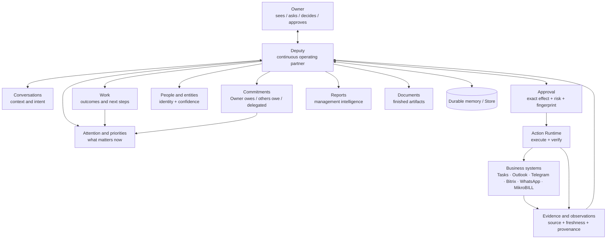
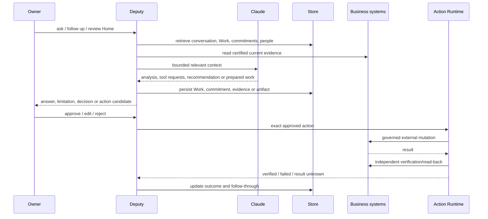
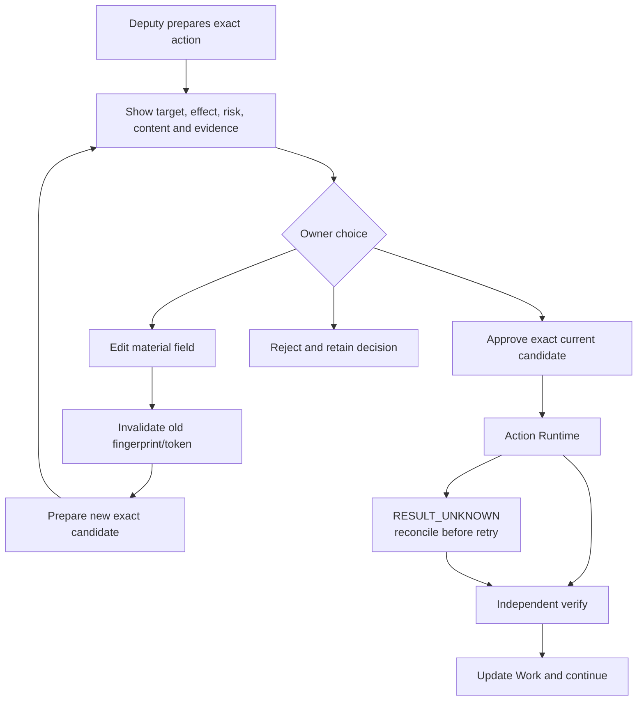
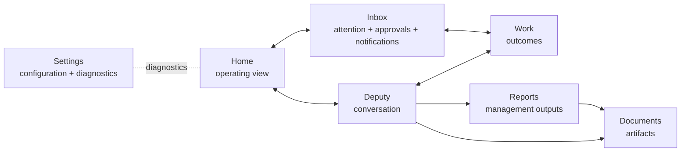

# Deputy product map / Deputy-ի արտադրանքային քարտեզ

This map describes the product in business terms first. Technical ownership is listed after the product diagrams.

## 1. Product relationship map

Հայերեն՝ Owner-ը շփվում է մեկ Deputy-ի հետ, իսկ Deputy-ը կապում է Conversations, Work, Commitments, People, Attention, Evidence, Reports, Documents և արտաքին Business systems-ը։

## 2. Operating loop

```mermaid
flowchart LR
    O[Observe source event]
    N[Normalize + dedupe]
    C[Retrieve current context]
    R[Reason with Claude]
    W[Update Work / commitments / memory]
    P[Prepare report / draft / action]
    S[Surface Home / Inbox / Work / chat]
    D[Owner decides / edits / approves]
    X[Action Runtime executes]
    V[Independent verify]
    F[Follow through]
    O --> N --> C --> R --> W --> P --> S --> D --> X --> V --> F --> O
```

**Important:** internal preparation does not wait for approval. Approval starts at the material external mutation boundary.

Հայերեն՝ ներքին պատրաստումը հաստատում չի պահանջում։ Հաստատումը սկսվում է այն պահին, երբ Deputy-ը պատրաստվում է նյութական արտաքին փոփոխություն կատարել։

## 3. User → Deputy → business systems

## 4. Approval and execution

## 5. Product surfaces

## 6. Conceptual ownership map

| Product concept | Meaning | Current canonical implementation owner |
|---|---|---|
| Conversation | durable multi-turn interaction | `conversation_store.py` |
| Observation | source event/fact | registered integration adapters + Store |
| Evidence | provenance-backed support | Store + source adapters |
| Person/entity | identity link with confidence | Store / people capability |
| Work | durable outcome | `work_orchestrator.py` |
| Commitment | obligation and follow-up | `commitments.py` |
| Decision | durable choice/rationale | `decisions.py` |
| Attention | prioritised situation | alerts/attention state |
| Approval | exact Owner authority | `actions.py` |
| Action | external mutation candidate/execution | `actions.py` |
| Artifact | generated document/report | `document_exports.py` |
| Source/integration | declared capability and health | `registry.py` + `health.py` |

## 7. Truth labels

- **CONFIRMED / LIVE:** directly observed in current OCI runtime.
- **IMPLEMENTED / NOT LIVE-CERTIFIED:** code/tests exist; current host evidence is missing.
- **DESIGNED / INTENDED:** product behavior defined by architecture/governance but not universal live proof.
- **PARTIAL:** usable with a declared limitation.
- **BLOCKED / NEEDS SETUP:** external credential, callback or runtime dependency is missing.
- **FUTURE / PROPOSED:** not represented as current capability.
